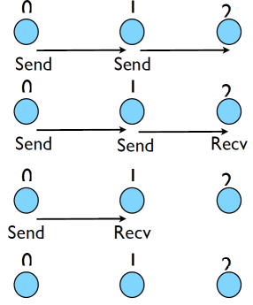
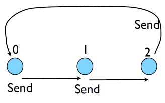

## More complicated example:
- Let's look at secondmessage.f90, secondmessage.c
- MPI programs routinely work with thousands of processors.
- if rank == 0... if rank == 1... if rank == 2...  gets a little tedious around rank=397.
- More typical programs: calculate the ranks you need to communicate with, and then communicate with them.
- Let's see how that works.
- Imagine procs in a line. Calculate left neighbour, right neighbour.
- Pass a number (let's use squared rank) to right neighbour, receive it from left.
- **C**:

```
#include <stdio.h>
#include <mpi.h>

int main(int argc, char **argv) {
    int rank, size, ierr;
    int left, right;
    int tag = 1;
    double msgsent, msgrcvd;
    MPI_Status rstatus;

    ierr = MPI_Init(&argc, &argv);
    ierr = MPI_Comm_size(MPI_COMM_WORLD, &size);
    ierr = MPI_Comm_rank(MPI_COMM_WORLD, &rank);

    left = rank-1;
    if (left < 0) left = MPI_PROC_NULL;
    right = rank+1;
    if (right >= size) right = MPI_PROC_NULL;

    msgsent = rank*rank;
    msgrcvd = -999.;

    ierr = MPI_Ssend(&msgsent, 1, MPI_DOUBLE, right,tag, MPI_COMM_WORLD); 
                     
    ierr = MPI_Recv(&msgrcvd, 1, MPI_DOUBLE, left, tag, MPI_COMM_WORLD, &rstatus);

    printf("%d: Sent %lf and got %lf\n", rank, msgsent, msgrcvd);

    ierr = MPI_Finalize();
    return 0;
}
```
- **Fortran**:

```
program secondmessage
use mpi
implicit none

    integer :: ierr, rank, comsize
    integer :: left, right
    integer :: tag
    integer :: status(MPI_STATUS_SIZE)
    double precision :: msgsent, msgrcvd

    call MPI_INIT(ierr)
    call MPI_COMM_RANK(MPI_COMM_WORLD,rank,ierr)
    call MPI_COMM_SIZE(MPI_COMM_WORLD,comsize,ierr)

    left = rank-1
    if (left < 0) left = MPI_PROC_NULL 
    right = rank+1
    if (right >= comsize) right = MPI_PROC_NULL 

    msgsent = rank*rank
    msgrcvd = -999.
    tag = 1
  
    call MPI_Ssend(msgsent, 1, MPI_DOUBLE_PRECISION, right, &
                   tag, MPI_COMM_WORLD, ierr)
              
    call MPI_Recv(msgrcvd, 1, MPI_DOUBLE_PRECISION, left, & 
                  tag, MPI_COMM_WORLD, status, ierr)
                  
    print *, rank, 'Sent ', msgsent, 'and recvd ', msgrcvd

    call MPI_FINALIZE(ierr)

end program secondmessage
```

## Compile and run

- mpi{cc,f90} -o secondmessage secondmessage.{c,f90}
- mpirun -np 4 ./secondmessage

```
$ mpirun -np 4 ./secondmessage
3: Sent 9.000000 and got 4.000000
0: Sent 0.000000 and got -999.000000
1: Sent 1.000000 and got 0.000000
2: Sent 4.000000 and got 1.000000
```




## Implement periodic boundary conditions

- `cp secondmessage.{c,f90} thirdmessage.{c,f90}`
- edit so it `wraps around': rank (size-1) sends to rank 0, rank 0 receives from size-1.
- mpi{cc,f90} thirdmessage.{c,f90} -o thirdmessage
- mpirun -np 3 thirdmessage


- In Fortran, that might look like this:

```
left = rank-1   
if(left < 0) left = comsize-1  
right = rank + 1
if(right >= comsize ) right =0  

call MPI_Ssend(msgsent, 1, MPI_DOUBLE_PRECISION, right, tag, MPI_COMM_WORLD, ierr)  
call MPI_Recv( msgrcvd, 1, MPI_DOUBLE_PRECISION, left,  tag, MPI_COMM_WORLD, status, ierr)
```
- And similarly in C.
- So what happens?

## Deadlock
* A classic parallel bug
* Occurs when a cycle of tasks are for the others to finish.
* Whenever you see a closed cycle, you likely have (or risk) deadlock.



# Big MPI Lesson #1

All sends and receives must be paired, **at time of sending**

