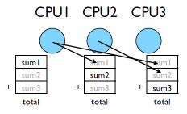

## Min, Mean, Max of numbers

We've just seen one common communications pattern: let's look at another.
Let's try some code that calculates the min/mean/max of a bunch of random numbers im the range -1..1. The min/mean/max should go to -1,0,+1 for large N.

Each process gets a partial result and sends it to some node, say node 0 (why node 0?) 
* ~/mpi/mpi-intro/minmeanmax.{c,f90}
Here's the serial code. How do we parallelize it with MPI?

**Fortran**:

```
program randomdata
implicit none
    integer ,parameter :: nx=1500
    real,allocate :: dat(:)

    integer :: i
    real :: datamin,datamax,datamean
    !  
    ! random data  
    !
    allocate(dat(nx))
    call random_seed(put=[(i,i=1,8])
    call random_number(dat)
    dat=2*dat-1.
    !  
    ! find min/mean/max  
    !
    datamin= minval(dat)
    datamax= maxval(dat)
    datamean= (1.*sum(dat))/nx

    deallocate(dat)

    print *,'min/mean/max =', datamin, datamean, datamax

    return
    end
```

**C**:

```
    /* .... */
    /*  
     * generate random data  
     * /  
    dat=(float *)malloc(nx * sizeof(float));
    srand(0);
    for(i=0;i<nx;i++)
    {
    	dat[i]= 2*((float)rand()/RAND_MAX)-1;
    }

    /*  
     * find min/mean/max 
     */
    datamin = 1e+19;
    datamax = -1e+19;
    datamean = 0;

    for(i=0;i<nx;i++){
    	if (dat[i] < datamin) datamin=dat[i];
    	if (dat[i] > datamax) datamax=dat[i];
    	datamean += dat[i];
    	}
    datamean /= nx;
    free(dat);

    printf("Min/mean/max =%f,%f,%f\n",datamin,datamean,datamax);
```

- Let's try something like this, where everyone calculates their local min, mean, max, then sends everything to rank 0 (say) to combine the results:


> ## Complete the code
> Find the code in ```mpi-tutorial/mpi-intro/minmeanmax-mpi.{c,f90}```
> It's missing a few parameters to MPI_Ssend and MPI_Recv.
> Fill them in, compile it and test it.
> Are the sends and receives adequately paired?
>
> > ## Solutions
> > 
> > Fortran fragment:
> > ```
> >     datamin = minval(dat)
> >     datamax = maxval(dat)
> >     datamean = (1.*sum(dat))/nx
> >     deallocate(dat)  
> > 
> >     if (rank /= 0) then
> >         sendbuffer(1) = datamin
> >         sendbuffer(2) = datamean
> >         sendbuffer(3) = datamax
> >         call MPI_Ssend(sendbuffer, 3, MPI_REAL, 0, ourtag, MPI_COMM_WORLD, ierr)  
> >     else
> >         globmin = datamin
> >         globmax = datamax
> >         globmean = datamean
> >             
> >     	do i=2,comsize 
> >             call MPI_Recv(recvbuffer, 3, MPI_REAL, MPI_ANY_SOURCE, &
> >                           ourtag, MPI_COMM_WORLD, status, ierr)
> >             if (recvbuffer(1) < globmin) globmin=recvbuffer(1)
> >             if (recvbuffer(3) > globmax) globmax=recvbuffer(3)
> >             globmean = globmean + recvbuffer(2)
> >         enddo
> > 
> >         globmean = globmean / comsize
> >     endif
> > 
> >     print *,rank, ': min/mean/max = ', datamin, datamean, datamax
> > ```
> > 
> > C fragment:
> > ```
> > 
> >     if (rank != masterproc) {
> >         ierr = MPI_Ssend(minmeanmax,3,MPI_FLOAT,masterproc,tag,MPI_COMM_WORLD);
> >     } 
> >     else {
> >         globminmeanmax[0] = datamin;
> >         globminmeanmax[2] = datamax;
> >         globminmeanmax[1] = datamean;
> >     }   
> >     for (i=1;i<size;i++) {
> >         ierr = MPI_Recv(minmeanmax,3,MPI_FLOAT,MPI_ANY_SOURCE,tag,MPI_COMM_WORLD,&rstatus);
> >         globminmeanmax[1] += minmeanmax[1];
> > 
> >         if (minmeanmax[0] < globminmeanmax[0])
> >             globminmeanmax[0] = minmeanmax[0];
> > 
> >         if (minmeanmax[2] > globminmeanmax[2])
> >             globminmeanmax[2] = minmeanmax[2];
> >     }
> >     globminmeanmax[1] /= size;
> >     printf("Min/mean/max = %f,%f,%f\n", globminmeanmax[0],globminmeanmax[1],globminmeanmax[2]);
> > ```
> {: .solution}
{: .challenge}

## But not very efficient!
- Requires (P-1) messages, 2(P-1) if everyone then needs to get the answer.



## Better summing
- Pairs of processors; send partial sums
- Max messages received log2(P)
- Can repeat to send total back


__Reduction; works for a variety of operators(+,*,min,max...)__


```

    print *,rank,': min/mean/max = ', datamin, datamean, datamax
       
    !
    ! Combine data
    !
    call MPI_ALLREDUCE(datamin, globmin, 1, MPI_REAL, MPI_MIN, &
                       MPI_COMM_WORLD, ierr)
    !
    ! If only task 0 needs the result:
    !    call MPI_REDUCE(datamin, globmin, 1, MPI_REAL, MPI_MIN, &
    !                    0, MPI_COMM_WORLD, ierr)
    !
    call MPI_ALLREDUCE(datamax, globmax, 1, MPI_REAL, MPI_MAX, &
                       MPI_COMM_WORLD, ierr)
    call MPI_ALLREDUCE(datamean, globmean, 1, MPI_REAL, MPI_SUM, &
                       MPI_COMM_WORLD, ierr)
    globmean = globmean/comsize
    if (rank == 0) then
        print *, rank,': Global min/mean/max=',globmin,globmean,globmax 
    endif
 
```
- MPI_Reduce and MPI_Allreduce
- Performs a reduction and sends answer to one PE (Reduce) or all PEs (Allreduce)

## Collective Operations


- As opposed to the pairwise messages we've seen
- __All__ processes in the communicator must participate
- Cannot proceed until all have participated
- Don't necessarily know what goes on `under the hood'
- Again, _can_ implement these patterns yourself with Sends/Recvs, but less clear, and probably slower.

> ## Run the AllReduce code
> Find the code in ```mpi-tutorial/mpi-intro/minmeanmax-allreduce.f90```
> Examine it, compile it, test it.
{: challenge}

## Common patterns of communication

Here are some families of MPI routines that implement common communication patterns.

- MPI_Bcast: Broadcast data from one process to all--- every process gets a copy
- MPI_Scatter: Scatter data from one process to all--- every process gets a different slice
- MPI_Gather: Collect data from all processes to one process, opposite of Scatter
- MPI_AllGather: A variation on Gather where the result is then distributed to all processes
- MPI_AllToAll: Scatter/Gather from all procs to all procs--- In other words, a complete exchange (of some data structure)
- MPI_AllReduce: Global reduction (e.g. sum, max, min, ...) where the result is then broadcast to all procs
- MPI_Barrier: Forces all processes to synchronize, i.e. wait for the last one to catch up before moving on

By "families" we mean that there are several related routines in each family, e.g. `MPI_Scatter, MPI_IScatter, MPI_ScatterV, MPI_IScatterV`


